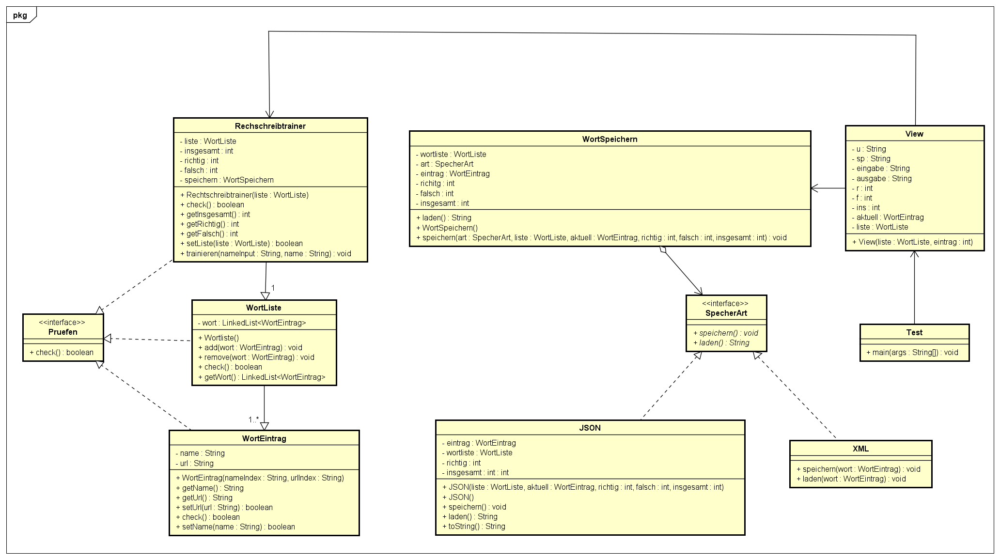

# Worttrainer
Pavel Bakshi

## UML Diagramm


## Gradle
Depandancy:

```java
dependencies {
    // Use JUnit Jupiter for testing.
    testImplementation 'org.junit.jupiter:junit-jupiter:5.9.3'
    implementation 'com.google.code.gson:gson:2.8.9'
    implementation 'org.json:json:20210307'
    testRuntimeOnly 'org.junit.platform:junit-platform-launcher'
}
```

Gradle im Projekt;

```java
$ gradle init

Select type of build to generate:
  1: Application
  2: Library
  3: Gradle plugin
  4: Basic (build structure only)

$ 3
```

## GUI

wichtige imports:

```java
import javax.imageio.ImageIO;
import javax.swing.*;
import java.awt.*;
import java.awt.event.ActionEvent;
import java.awt.event.ActionListener;
import java.awt.image.BufferedImage;
import java.io.IOException;
import java.net.URL;
import org.json.JSONObject;
```
